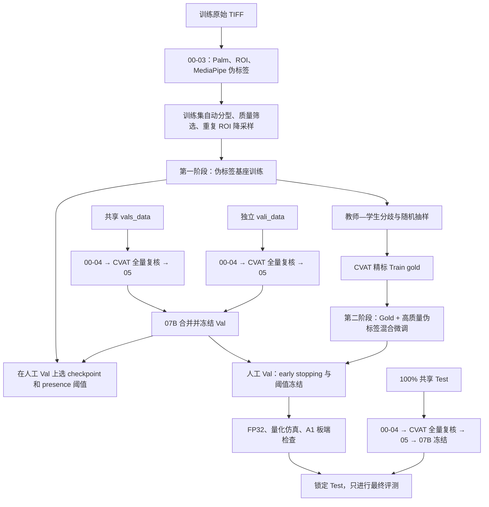

# Hand Landmarker 两阶段训练流程总览

> 文档定位：整体性说明文档，供项目成员理解训练闭环。  
> 适用项目：AetherSign / HandLandmarkerFab。  
> 更新时间：2026-07-10。  
> 本文只规定数据与训练流程，不修改当前代码。

## 1. 目标与核心决策

当前目标不是重新训练 Palm Detector，而是训练一个适合 A1 板端部署的轻量 Hand Landmarker，使其在项目采集域内尽可能接近 Google MediaPipe Hand Landmarker，并通过少量人工金标准数据纠正教师模型的系统误差。

采用两个阶段：

1. **第一阶段：教师—学生伪标签学习**。使用 Google MediaPipe 生成的大规模伪标签训练学生模型，获得覆盖手型、光照、姿态、ROI 偏移和背景变化的基座模型。
2. **第二阶段：人工金标准数据微调**。从训练域中选择少量高价值 ROI 进行精细人工复核，再与第一阶段的高质量伪标签混合训练，纠正教师漏检、关键点偏差和 presence 错误。

这条路线属于教师—学生伪标签学习或模型模仿。由于当前 MediaPipe Python API 没有导出 hand presence 的连续分数，也没有逐点置信度，因此目前主要使用离散 presence、handedness 和 21 点坐标监督，不是完整的 soft-logit 知识蒸馏。

不需要人工复核约 66000 个训练 ROI。人工时间优先投入：

1. 全量复核主验证集和主测试集；
2. 随机抽查一部分训练集以估计伪标签错误率；
3. 根据教师—学生分歧选择困难训练样本精标；
4. 使用人工金标准训练样本完成第二阶段微调。

## 2. 数据集角色

| 数据集 | 当前规模 | 标签质量 | 是否更新模型参数 | 主要用途 |
|---|---:|---|---|---|
| Train pseudo | 约 66000 ROI | Google MediaPipe 伪标签，存在噪声 | 是，第一阶段 | 学习教师行为和数据域多样性 |
| Train gold | 建议 1500～3000 ROI，可分批增加 | 人工复核的近似金标准 | 是，第二阶段 | 纠正伪标签偏差和困难样本 |
| Val | 当前 1028 ROI，人工复核后剔除 ignore | 人工金标准 | 否 | 选 checkpoint、调 presence 阈值、early stopping |
| Test | 当前 856 ROI，人工复核后剔除 ignore | 人工金标准 | 否 | 最终冻结方案的独立评测 |

这里的 Train gold 必须来自训练集原图或额外训练域录制，不能从 Val/Test 移入。Val 支持两个阶段的模型选择与诊断；Test 只评估预登记并冻结的最终候选。二者都**不得参与反向传播、数据增强训练或伪标签再训练**。

详细处理规则见：

- [训练集处理方案](flow_and_interface/hand_landmarker_train_dataset_processing.md)
- [验证集处理方案](flow_and_interface/hand_landmarker_val_dataset_processing.md)
- [测试集处理方案](flow_and_interface/hand_landmarker_test_dataset_processing.md)
- [处理系统修正计划](flow_and_interface/hand_landmarker_pipeline_revision_plan.md)
- [数据集制作操作手册](flow_and_interface/dataset_preparation_workflow.md)

> 当前实现状态：07A、07B、quality catalog 和 stage-specific 输出已经实现，可直接按本文命令运行。

## 3. 总体流程



人工复核之前，Train/Val/Test 都继续使用相同的 `00`、`01`、`02`、`03` 流程，只通过不同配置文件指定路径和是否保留低分 Palm 候选：

- Train：`configs/autolabel_train.yaml`
- 共享 Val：`configs/autolabel_val.yaml`，对应 `vals_data`
- 独立 Val：`configs/autolabel_vali.yaml`，对应 `vali_data`
- Val 最终合并：`configs/finalize_val.yaml`
- Test 最终合并：`configs/finalize_test.yaml`
- Test：`configs/autolabel_test.yaml`

Val/Test 已关闭 `negative_candidates` 导出，只评估板端 Palm 阈值实际会送入 Hand Landmarker 的 detections。该设计应保持不变。

## 4. 第一阶段：教师—学生伪标签学习

### 4.1 输入

第一阶段使用：

- 约 22000 个本方 ROI；
- 约 46000 个队友 ROI；
- `hand_roi_crops_manifest.jsonl`；
- `hand_landmarks_autolabel_draft.jsonl`；
- `02_roi_crops/images/*.png`；
- 自动生成的样本类型、质量标记、去重结果和训练权重。

两份训练数据合并前必须增加数据源命名空间并验证 `crop_id`、`crop_path` 全局唯一。当前 ID 由原图 stem 和 Palm candidate 序号生成；如果两位成员存在同名 TIFF，直接合并可能覆盖图片或 JSONL 索引。

### 4.2 训练目标

学生模型输出：

```text
landmarks: 42 维，即 21 个 (x, y)
hand_flag: 当前 ROI 是否存在有效目标手
handedness: Left / Right
```

对应损失：

- landmark：优先使用 Smooth L1/Huber；
- hand presence：BCE；若模型输出已经过 sigmoid，使用 `from_logits=false` 等价配置；
- handedness：BCE；同样必须确认输出是 logit 还是 sigmoid 概率；
- 无手样本的 landmark 和 handedness loss 必须为 0；
- handedness 未知的正样本不训练 handedness head。

第一阶段不能把所有 ROI 等权打乱。必须先完成：

1. schema 和数值合法性检查；
2. 伪标签样本分型；
3. 同一原图内重复手实例聚类；
4. 低分负候选限额；
5. 按样本类型采样；
6. 输出每类数量与实际有效样本量。

### 4.3 推荐 curriculum

第一阶段内部可以再分两段，但仍属于同一次伪标签基座训练：

1. 前 30%～40% epoch：高质量伪标签正样本、可靠负样本、少量 hard negative；
2. 后 60%～70% epoch：加入中等质量正样本，降低其 landmark 或 sample weight；
3. 全程排除结构冲突和严重歧义；高质量重复 ROI 不改变质量等级，而是按物理手 cluster 归一化总权重或跨 epoch 轮换。

数据增强必须同步变换关键点：

- 可使用灰度亮度/对比度、噪声、轻微模糊；
- 小幅旋转、缩放、平移后必须同步更新 21 点坐标；
- 水平翻转只在单元样例确认 TIFF 镜像状态、CVAT Left/Right、MediaPipe 与板端约定完全一致后启用；启用时同步执行 `x -> 1-x` 并交换 Left/Right，否则先禁用；
- 不得使用会破坏手部拓扑但未同步标签的增强。

### 4.4 第一阶段结束条件

第一阶段模型应至少满足：

- 在人工 Val 上明显优于随机初始化与未收敛基线；
- presence precision/recall 达到可用水平；
- 21 点误差稳定下降且没有由负样本比例造成的退化；
- handedness 接近教师和人工标签；
- 学生模型对全部 eligible catalog 完成推理且无 NaN/Inf、预测覆盖率为 100%，并能输出供主动复核排序的可复现结果。

## 5. 第二阶段：人工金标准混合微调

### 5.1 Train gold 的来源

Train gold 由两部分组成：

1. **随机分层抽样**：覆盖两位成员的数据源、Left/Right、positive/negative、Palm score 分桶、明暗、黑边、模糊、遮挡和 ROI 偏移，用于估计伪标签真实错误率；
2. **主动挑错抽样**：优先选择教师与学生在 presence、handedness 或关键点位置上分歧较大的样本，以及 `needs_review=true`、高 Palm 分数却 teacher 无手等样本。

建议先精标 1500～3000 个训练 ROI。若时间更紧，可先完成约 500 个随机审计样本和约 1000 个主动挑错样本，再根据 Val 收益决定是否继续扩充。

### 5.2 微调方式

不建议只使用几百张 Gold 连续训练很多 epoch，因为这容易过拟合并遗忘第一阶段获得的姿态、背景和光照覆盖。

推荐每个 batch：

```text
Train gold：30%～50%
高质量 pseudo replay：50%～70%
```

也可以通过过采样 Gold 达到相同目的。优先使用采样比例表达 Gold 优先级，避免同时使用极端过采样和极大 loss weight。

微调时：

- 从第一阶段最佳 checkpoint 初始化；
- 使用更小学习率；
- 根据人工 Val early stopping；
- presence 阈值只在 Val 上选择；
- Test 在模型、阈值、量化方案全部冻结后才评测。

## 6. Val/Test 在两个阶段中的作用

同一份人工金标准 Val/Test 可以并且应该用于比较两个独立训练方案。共享评测集不会破坏训练路线独立性，反而提供可比的统一标尺；其中 Val 可反复用于两个阶段，Test 保持锁定。

推荐协作规则：

- 两位成员共享同一份人工 Val；
- 两位成员共享同一份锁定 Test；
- 两位成员可以采用不同训练代码、loss、采样、增强和超参数；
- Test 标签和最终结果由一人保管或通过固定脚本统一评测，避免反复查看 Test 调参；
- 如需额外保持路线差异，每位成员可拥有少量 private dev 数据，但无需各自重新精标一套完整 Val/Test。

## 7. 评价指标

### 7.1 Hand presence

在所有未 ignore 的 Val/Test ROI 上报告：

- Precision；
- Recall；
- F1；
- False Positive Rate；
- False Negative Rate；
- confusion matrix；
- 按 Palm score、光照和 hard-negative 分桶的指标。

不能只报告 accuracy，因为 Val 与 Test 的正负比例不同，且大量负样本可能掩盖 positive recall 的下降。

### 7.2 Landmarks

主 landmark 指标在**所有人工 GT positive** 上报告，不能因为模型把 presence 预测为 false 就排除该 ROI，否则会产生幸存者偏差。若模型的 landmark head 始终输出 42 维，则直接计算；若推理程序会按 presence 门控，需要把 false negative 作为 landmark failure 单独计入并同时报告覆盖率。

主指标使用 `256x256` crop 坐标 `landmarks_crop_px`：

- 每个 ROI 的 21 点平均欧氏像素误差；
- 上述“每 ROI 21 点平均误差”在数据集上的 median / P90 / P95；
- 每个 landmark id 的平均误差；
- NME：以人工 21 点外接框对角线作为统一归一化尺度；
- PCK@0.05、PCK@0.10、PCK@0.15，阈值相对同一归一化尺度；
- GT positive 总数和 landmark 输出覆盖率；
- 可另报 `landmark | presence true-positive` 条件指标，但不能替代主指标。

归一化公式和阈值一旦确定，两个成员、FP32、量化模型和板端结果必须使用同一实现。

### 7.3 Handedness

只在人工确认有手且 Left/Right 可判定的样本上报告：

- overall accuracy；
- Left recall；
- Right recall；
- confusion matrix。

### 7.4 两类评测口径

需要区分：

1. **Hand Landmarker 条件指标**：只对 Palm 已产生 ROI 的样本评估 Hand Landmarker；
2. **端到端系统指标**：从原始 TIFF 开始，Palm 完全漏检也计入系统失败。

本轮现有 ROI Gold 只能直接支持第一类。要计算第二类，必须额外制作原图级 Gold，至少记录每张 TIFF 的真实手数量/hand presence 和手实例；没有这层标注时不能声称已经测得 Palm recall 或端到端漏检率。最终板端若补齐原图 Gold，再同时报告第二类。

### 7.5 分场景报告

至少按以下场景检查：

- 正常光照；
- 暗光/红外；
- 运动模糊；
- 边缘手和黑色 padding；
- 局部遮挡；
- ROI 偏移；
- 单手；
- 双手干扰挑战集。

主 Val/Test 中被 `ignore_for_training` 排除的歧义双手 ROI 不计入主指标，可以单独形成挑战集并报告覆盖率与失败案例。

双手 ROI 是否可进入主指标，必须按 [验证集处理方案第 5 节](flow_and_interface/hand_landmarker_val_dataset_processing.md) 执行 `crop_id → palm_det_id → bbox/p0/p9` 的目标手追溯；不能用“最大、最居中或 Google 先标到的手”替代 Palm anchor 证据。

## 8. 模型选择与实验记录

每次实验至少记录：

- 训练数据版本和输入 JSONL 哈希；
- 每种样本类型数量；
- 去重前后数量；
- batch 采样比例；
- 每个 head 的 loss 与权重；
- 数据增强；
- 随机种子；
- 最佳 checkpoint 和选择依据；
- Val presence 阈值；
- FP32、量化仿真和板端版本；
- Test 是否已解锁评测。

最低对比实验：

1. 过滤并降采样后的伪标签基座；
2. 基座 + Gold 混合微调；
3. 如时间允许，再比较“全部伪标签等权训练”以量化筛选收益，但不把它作为默认正式方案。

## 9. 数据泄漏与版本冻结

- Train、Val、Test 必须按原始录制 session 划分，而不是把同一 session 的相邻帧分到不同 split；
- 同一原始 TIFF 产生的所有 ROI 必须属于同一 split；
- Val/Test 不参与教师—学生再标注训练；
- Test 不用于选 epoch、阈值、增强或量化参数；
- 人工修改 Val/Test 后必须形成版本号和文件哈希；
- 两位成员共享评测集时，必须使用完全相同的 Gold JSONL 和评测脚本。

## 10. 参考依据

- [Distilling the Knowledge in a Neural Network](https://arxiv.org/abs/1503.02531)
- [Self-Training With Noisy Student Improves ImageNet Classification](https://openaccess.thecvf.com/content_CVPR_2020/html/Xie_Self-Training_With_Noisy_Student_Improves_ImageNet_Classification_CVPR_2020_paper.html)
- [Data Distillation: Towards Omni-Supervised Learning](https://openaccess.thecvf.com/content_cvpr_2018/html/Radosavovic_Data_Distillation_Towards_CVPR_2018_paper.html)
- [Wing Loss for Robust Facial Landmark Localisation](https://openaccess.thecvf.com/content_cvpr_2018/html/Feng_Wing_Loss_for_CVPR_2018_paper.html)
